# Entity Relationship Diagram (ERD)

Status: living document, generated from `apps/api/prisma/schema.prisma` on
2026-08-31. When the schema changes, this document should be regenerated or
hand-updated to match; treat the schema file as the source of truth if the
two disagree.

## 1. Tenancy model

`Club` is the tenant root of the system. Almost every operational table
carries a `clubId` column. Parent tables that have children expose a
composite unique constraint of `(clubId, id)`, and child tables foreign-key
on `(clubId, parentId)` rather than on `id` alone. The practical effect: a
row from one club can never be attached to another club's data, because the
database schema does not permit it, not merely because application code
checks for it.

`Membership` is the identity that most club data actually hangs off, not
`User` directly. This matters because `Membership.userId` is nullable: an
officer can create a roster row for someone by name and phone number before
that person has ever created an account. When someone registers with a
matching phone number, their new `User` is linked to the existing
`Membership` automatically, carrying forward any roles, history, and
attendance records that were already recorded against them.

Above the club sits a three-level organizational hierarchy: `District` to
`Division` to `Area` to `Club`. `Club` denormalizes its `areaId`,
`divisionId`, and `districtId` so lineage can be read without a join chain,
which is also what lets Area/Division/District Director scopes filter
directly.

## 2. Diagram

```mermaid
erDiagram
    DISTRICT ||--o{ DIVISION : contains
    DIVISION ||--o{ AREA : contains
    AREA ||--o{ CLUB : contains

    USER ||--o{ MEMBERSHIP : "has (0..n clubs)"
    USER ||--o| CREDENTIAL_SHARE : "one-time password"
    USER ||--o{ REFRESH_TOKEN : issues
    USER ||--o{ PUSH_SUBSCRIPTION : registers
    USER ||--o{ ORG_ASSIGNMENT : "may hold"

    CLUB ||--o{ MEMBERSHIP : roster
    CLUB ||--o{ INVITE : issues
    CLUB ||--o{ JOIN_REQUEST : receives
    CLUB ||--o{ MEETING : schedules
    CLUB ||--o{ PROSPECT : tracks
    CLUB ||--o{ ASSET : stores
    CLUB ||--o{ LIBRARY_DOCUMENT : stores
    CLUB ||--o{ PLANNER_IDEA : plans
    CLUB ||--o{ INVENTORY_ITEM : owns
    CLUB ||--o{ TRANSACTION : records
    CLUB ||--o{ BUDGET_LINE : budgets
    CLUB ||--o{ ACTIVITY_LOG : audits
    CLUB ||--o{ TASK : assigns
    CLUB ||--o{ PLANNER_ROW : plans

    MEMBERSHIP }o--o{ MEETING_ROLE_ASSIGNMENT : holds
    MEMBERSHIP }o--o{ MEETING_SPEAKER : "speaks / evaluates"
    MEMBERSHIP ||--o{ HISTORY_EVENT : accrues
    MEMBERSHIP ||--o{ EVALUATION : "gives or receives"
    MEMBERSHIP ||--o{ SPEECH_SLOT_REQUEST : requests
    MEMBERSHIP ||--o{ MEETING_ATTENDANCE : marks
    MEMBERSHIP ||--o{ TASK_ASSIGNEE : assigned
    MEMBERSHIP ||--o{ DUES_RECORD : owes

    MEETING ||--o{ MEETING_ROLE_ASSIGNMENT : has
    MEETING ||--o{ MEETING_SPEAKER : has
    MEETING ||--o{ EVALUATION_SUBMISSION : collects
    MEETING ||--o{ TABLE_TOPIC_QUESTION : has
    MEETING ||--o{ MEETING_ATTENDANCE : records
    MEETING ||--o{ MEETING_GUEST_ATTENDANCE : records
    MEETING ||--o{ CHECKLIST_ITEM : has
    MEETING ||--o| PLANNER_ROW : "linked from"

    MEETING_SPEAKER ||--o{ EVALUATION_SUBMISSION : receives

    PROSPECT ||--o{ CONTACT_LOG : has
    PROSPECT ||--o{ VISIT_LOG : has
    PROSPECT }o--o{ MEETING_ROLE_ASSIGNMENT : "may hold (as guest)"
    PROSPECT }o--o{ MEETING_SPEAKER : "may speak (as guest)"
    PROSPECT ||--o{ MEETING_GUEST_ATTENDANCE : records

    TASK ||--o{ TASK_ASSIGNEE : has
    TASK ||--o{ TASK_NOTE : has

    DUES_RECORD |o--o| TRANSACTION : "auto-creates income row"
```

The diagram omits the enum types and a small number of low-cardinality
lookup relations for readability. Full field lists follow below.

## 3. Enumerations

| Enum                      | Values                                                                                                          |
| ------------------------- | --------------------------------------------------------------------------------------------------------------- |
| `UserStatus`              | active, suspended                                                                                               |
| `ClubDirectoryStatus`     | active, low, suspended                                                                                          |
| `ClubLifecycle`           | active, inactive, chartered                                                                                     |
| `ClubJoinPolicy`          | request, closed, open                                                                                           |
| `MembershipStatus`        | active, removed                                                                                                 |
| `MemberType`              | new, existing                                                                                                   |
| `ClubRole`                | ClubAdmin, Guest, IPP, Member, President, Secretary, SergeantAtArms, Treasurer, VPEducation, VPMembership, VPPR |
| `OrgRole`                 | AreaDirector, DivisionDirector, DistrictDirector                                                                |
| `OrgUnitType`             | area, division, district                                                                                        |
| `InviteStatus`            | pending, accepted, revoked, expired                                                                             |
| `JoinRequestStatus`       | pending, approved, declined, withdrawn                                                                          |
| `MeetingStatus`           | draft, published                                                                                                |
| `HistoryEventType`        | joined, levelReached, speechGiven, projectStarted, projectCompleted, roleTaken                                  |
| `SpeechSlotRequestStatus` | pending, approved, declined                                                                                     |
| `PlannerIdeaStatus`       | created, drafted, published                                                                                     |
| `TaskPriority`            | Low, Medium, High                                                                                               |

## 4. Entities by domain

### 4.1 Identity

**User**
Core account record. Authenticates by phone number (unique), not email.
Key fields: `phone` (unique), `email` (unique, nullable), `passwordHash`,
`firstName`, `lastName`, `status`, `isSuperAdmin`, `emailVerifiedAt`,
`tiMemberNumber`, `mustChangePassword`, `bio`, `avatarUrl`, `socials`
(JSON). Relations: many `Membership` (club memberships), many
`OrgAssignment`, many `RefreshToken`, many `Invite` sent, many
`JoinRequest`, one `CredentialShare`, many `PushSubscription`.

**CredentialShare**
A one-time credential handoff for users provisioned by an officer or Super
Admin rather than self-registered. Stores the plaintext password
temporarily, keyed by a token, one-to-one with `User`, and is deleted the
first time that user logs in.

**RefreshToken**
Hashed (never plaintext) refresh token. Fields: `familyId` (links every
token descended from one login), `revokedAt`, `replacedById`. Reuse of a
revoked token revokes the whole family.

**PushSubscription**
One row per browser/device subscribed to Web Push for a given user.
Fields: `endpoint` (unique), `p256dh`, `auth`, `userAgent`.

### 4.2 Organizational hierarchy

**District**: `name`, `code`. Has many `Division`, many `OrgAssignment`.

**Division**: `districtId` (FK). Has many `Area`, many `OrgAssignment`.

**Area**: `divisionId` (FK), denormalized `districtId`. Has many `Club`,
many `OrgAssignment`.

**OrgAssignment**: a director assignment: `userId`, `role` (`OrgRole`),
`unitType`, exactly one of `areaId` / `divisionId` / `districtId`,
`termStartsOn`, `termEndsOn`.

### 4.3 Tenant (club)

**Club**
The tenant root. Nullable `areaId`/`divisionId`/`districtId` (denormalized
lineage; a club need not be attached to the hierarchy). Fields: `name`,
`slug` (unique), `clubNumber` (unique), `motto`, `venueAddress`,
`venueMapUrl`, `contactPhone`, `socials` (JSON), `bannerColor`,
`bannerImage`, `bannerImagePos` (JSON: agenda banner customization),
`joinCode` (unique), `directoryStatus`, `lifecycle`, `joinPolicy`. Has many
of nearly every other tenant-scoped model listed below.

**Membership**
One row per (User, Club) pair, and the anchor for almost all per-member
data. `userId` is nullable (a roster row awaiting signup). Denormalized
`firstName`/`lastName`/`email`/`phone` so the roster is readable even
before a linked `User` exists. `roles` (`ClubRole[]`), `isClubAdmin`,
`status`, `memberType`. Embedded education profile: `pathway`, `level`,
`startingLevel`, `startedProject`, `pathwayStartedAt`. `grantOverrides`
(JSON) holds sparse per-member permission exceptions (`resource:action ->
allow/deny`). Constraints: `@@unique([clubId, userId])`,
`@@unique([clubId, id])` (the latter is what lets every child table
foreign-key on `(clubId, membershipId)`). Has many: `invitesCreated`,
`decidedJoinRequests`, `historyEvents`, `evaluationsReceived`,
`evaluationsGiven`, `timerEntries`, `ahCounterEntries`,
`speechSlotRequests`, `duesRecords`, `tasksCreated`, `tasksCompleted`,
`taskAssignments`, `taskNotes`, `meetingRoleAssignments`,
`meetingAttendance`, `speakerSlots`, `evaluatorSlots` (both via
`MeetingSpeaker`).

### 4.4 Onboarding

**Invite**: `clubId`, `roles` (`ClubRole[]`), `token` (unique), `status`,
`membershipId` (unique: the membership is pre-created before acceptance),
`invitedByUserId`, `expiresAt`.

**JoinRequest**: `clubId`, `userId`, `message`, `status`,
`decidedByMembershipId`, `decidedAt`.

### 4.5 Meetings

**Meeting**: `clubId`, `meetingNumber`, `dateTime`, `theme`, `status`, and
the grammarian's word of the day (`word`, `wordPartOfSpeech`,
`wordMeaning`, `wordExample`). `shareToken` (unique) backs the public
agenda link. Constraints: `@@unique([clubId, id])`,
`@@unique([clubId, meetingNumber])`. Has many `visitLogs`,
`checklistItems`, `roleAssignments`, `speakers`, `tableTopicQuestions`,
`attendanceRecords`, `guestAttendance`, `plannerRows`,
`evaluationSubmissions`.

**MeetingRoleAssignment**: `(clubId, meetingId, roleKey)` unique. Assigned
to either a `Membership` or a `Prospect` (guest), never both.

**MeetingSpeaker**: a prepared-speech slot, ordered 1 to 3, with `status`.
The speaker and evaluator can each be a `Membership` or a `Prospect`.
Fields: `title`, `duration`, `pathway`, `project`, `notes`.

**EvaluationSubmission**: anonymous, public feedback on a `MeetingSpeaker`.
Fields: `evaluatorName`, `isAssignedEvaluator`, `text`, `audioKey`,
`audioMimeType`, `audioDurationSec`, `imageKeys` (array).

**TableTopicQuestion**: `meetingId`, `text`, `asked` (boolean).

**MeetingAttendance**: member attendance. `@@unique([clubId, meetingId,
membershipId])`.

**MeetingGuestAttendance**: guest attendance, with a `name` snapshot taken
at record time so the entry survives even if the `Prospect` record later
changes.

**PlannerRow**: a term planner grid row (Education/Meetings), holding
`meetingNumber`, `dateTime` (ISO string), `theme`, `notes`, `assignees`
(JSON), and an optional `meetingId` once the row is realized as an actual
meeting.

### 4.6 Education

**HistoryEvent**: a single wide table covering six event types (`joined`,
`levelReached`, `speechGiven`, `projectStarted`, `projectCompleted`,
`roleTaken`) per membership, with `date`, `meetingNumber`, `role`, `title`,
`projectName`, `level`, `pathway` fields used as applicable to the type.

**Evaluation**: a peer evaluation of a speech, distinct from
`EvaluationSubmission` (which is the anonymous public-facing capture).
Fields: `membershipId` (the speaker), `evaluatorMembershipId`,
`speechEventId` (a soft reference, not a hard FK), `strengths`,
`improvement`, `overallRating`.

**TimerEntry**: `targetMinMinutes`, `targetMaxMinutes`, `actualSeconds`
per speech event.

**AhCounterEntry**: `fillerCounts` (JSON) per speech event.

**SpeechSlotRequest**: a member's request for a speaking slot in a future
meeting: `membershipId`, `meetingId`, `projectName`, `note`, `status`.

### 4.7 People (guest pipeline)

**Prospect** (database model name; exposed via the `guests` API path, shown
in the UI as "Guest"). Fields: `firstName`, `lastName`, `email`, `phone`,
`whatsapp`, `avatarUrl`, `socials` (JSON), `bio`, `notes`, `firstVisit`,
`lastVisit`, `visitCount`, `invitedBy`, and a pipeline `stage` (new,
contacted, interested, joined-meetings, joined-club, not-interested). Has
many `contactLogs`, `visitLogs`, `roleAssignments`, `speakerSlots`,
`evaluatorSlots`, `meetingAttendance`.

A `Prospect` can be created by hand (`firstName` and optional fields) or by
copying a name/email/phone from an existing `Membership` at another club
(`POST guests` with `membershipId`, backing the "add a member from another
club as a guest" flow). Either way it is a one-time copy at creation time,
not a live reference: `Prospect` has no `membershipId` column, so the new
guest row has no ongoing link back to the source membership.

**ContactLog**: `prospectId`, `method`, `outcome`.

**VisitLog**: `prospectId`, `meetingId` (nullable), `role`, `notes`,
`origin` (meeting or manual entry).

### 4.8 Library

**Asset**: an image, either inline as a data URL or stored in S3. Fields:
`title`, `imageUrl`, `mimeType`, `width`, `height`, `sizeBytes`.

**LibraryDocument**: a non-image file. Fields: `title`, `fileName`,
`fileUrl`, `mimeType`, `sizeBytes`.

**PlannerIdea**: a Library planner-board entry, keyed by `day` (a
`yyyy-mm-dd` string), with `title`, `body`, `attachments` (JSON), `status`.

### 4.9 Inventory

**InventoryItem**: `title`, `description`, `imageUrl`, `imageMimeType`.

**ChecklistItem**: a per-meeting setup checklist entry: `text`, `done`.

### 4.10 Finance

**Transaction**: the ledger. Fields: `date` (string), `direction`,
`category`, `amountMinor` (integer, smallest currency unit), `description`,
`method`, `counterparty`, `reference`, and an optional `duesRecordId`
(unique) linking a dues payment to its auto-created income row.

**DuesRecord**: one row per (member, dues period). Fields: `periodId`,
`membershipId`, `amountDueMinor`, `amountPaidMinor`, `waived`, `paidOn`,
`method`, `note`. `@@unique([clubId, periodId, membershipId])`.

**BudgetLine**: planned spend or income by category. Fields: `fiscalYear`,
`kind`, `category`, `plannedMinor`. `@@unique([clubId, fiscalYear,
category])`.

### 4.11 Tasks

**Task**: `title`, `description`, `priority`, `dueDate`, `done`,
`doneByMembershipId`, `doneAt`, `createdByMembershipId`.

**TaskAssignee**: pivot table, composite primary key `(taskId,
membershipId)`.

**TaskNote**: a freeform progress note attached to a task.

### 4.12 Activity

**ActivityLog**: the audit feed. Fields: `clubId`, `actorMembershipId`
(a soft reference, no hard FK, so the log survives membership deletion),
`category`, `action`, `summary`, `entityType`, `entityId`, and a reserved
`points` field for potential future gamification.

## 5. Notable modeling decisions

- **Composite tenant keys.** The `(clubId, id)` uniqueness pattern on every
  club-scoped parent table, matched by `(clubId, parentId)` foreign keys on
  children, is the single mechanism that makes cross-tenant data leakage a
  schema-level impossibility rather than an application-level discipline.
  The one deliberate exception is the guest-add member search (see
  [TDD.md, section 7.4](./TDD.md#74-cross-club-member-search)), which is a
  read-only, application-level scoped lookup, not a schema-level one.
- **Membership over User.** Nearly everything hangs off `Membership`, not
  `User`, because a club needs to be able to represent a person (roster
  entry, denormalized name/phone, roles, history) before that person has an
  account. `userId` is nullable for exactly this reason.
- **Dual guest/member actors in meetings.** `MeetingRoleAssignment` and
  `MeetingSpeaker` can each point at either a `Membership` or a `Prospect`,
  because a guest can hold a role or give a speech before ever becoming a
  member.
- **Snapshotted names.** `MeetingGuestAttendance.name` is stored as a
  snapshot rather than joined live from `Prospect`, so attendance history
  remains accurate even if a guest's name is later corrected or merged.
- **Soft references for durability.** `Evaluation.speechEventId` and
  `ActivityLog.actorMembershipId` are intentionally not hard foreign keys,
  so that evaluation and audit history outlive the deletion of the record
  they originally referenced.
